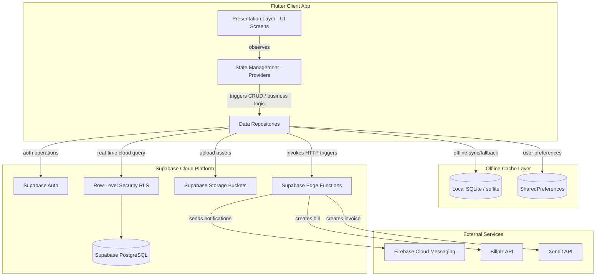

# EventEase - Technical Architecture Documentation

This document describes the high-level and detailed architecture of **EventEase**, a Flutter-based multi-tenant marketplace platform for events planning. The platform links Event Hosts (Customers), Vendors, and Platform Administrators in a secure, real-time environment.

---

## 🎯 Architecture Diagram

Below is the architectural data flow showing the client application, local offline caching layer, Supabase cloud backend, and external payment integrations.



---

## 📂 Architecture Paradigm

EventEase is built using a **Feature-First Clean Architecture** approach, which combines modularity by feature domains with structural layering (data, domain, presentation). This ensures decoupling, testability, and isolated deployment profiles.

### Structural Layers
Within each feature directory under `lib/features/`, the code is structured into:
1. **Data Layer (`data/`)**: Implements data sources, serialization models (JSON DTOs), and database repositories. This layer handles communication with local SQLite storage (`DatabaseHelper`) and remote cloud storage (`SupabaseService`).
2. **Domain/State Layer (`providers/`)**: Houses state machines via `ChangeNotifier` and `Provider`. It orchestrates business validation rules and makes repository requests.
3. **Presentation Layer (`presentation/`)**: Contains screen layouts (`views/`) and widgets (`widgets/`) built strictly using Flutter's Material Design 3 guidelines.

### Core-Features-Shared Split
- **`lib/core/`**: Houses app-wide infrastructures such as services, routing engines, config managers, theme models, and databases.
- **`lib/features/`**: Modules organized by business contexts. There are 20 business contexts inside the platform (e.g. `auth`, `booking`, `vendor`, `customer`, `chat`).
- **`lib/shared/`**: Common models, UI widgets, and global category providers shared by multiple features.

---

## 📁 Key Components & Folder Directory Map

```
lib/
├── core/
│   ├── config/             # Third-party configurations (e.g., Billplz, Xendit)
│   ├── constants/          # Application global rules (e.g., AppConfig)
│   ├── database/           # sqflite Database helper, SQLite repositories interface
│   ├── providers/          # System-level providers (Theme, Locale, AdProvider)
│   ├── services/           # External microservice interfaces (Supabase, Security, Payments)
│   └── utils/              # Utilities (Currency Formatter, App Routes, Custom Themes)
├── features/
│   ├── admin/              # Admin-specific modules (Dashboard, Admin Ads Screen)
│   ├── auth/               # User Authentication & Profiles (Supabase Auth interface)
│   ├── booking/            # Shopping Carts, Ordering, and Appointments
│   ├── customer/           # Customer Subscriptions, Favorites, and Reviews
│   ├── event/              # Event management, wishlists, and timelines
│   ├── finance/            # Vendor commission audits & installment settlements
│   ├── support/            # Customer support desk, tickets and disputes
│   └── vendor/             # Vendor dashboards, availability, and catalogs
├── shared/
│   ├── models/             # Reusable business entities (SeedData, ReviewModels)
│   └── widgets/            # Global UI elements (Custom buttons, indicators)
```

---

## ⚡ State Management

EventEase utilizes the `provider` library as its primary state management solution, supplemented by `ChangeNotifierProxyProvider` to handle dependency injection between providers (such as injecting `AuthProvider` or `BookingProvider` details into user-specific states).

### Data Access Contract Examples

```dart
// Dependency Injection mapping in main.dart
ChangeNotifierProxyProvider<AuthProvider, CartProvider>(
  create: (context) {
    final auth = Provider.of<AuthProvider>(context, listen: false);
    return CartProvider(userId: auth.isAuthenticated ? auth.userId : null);
  },
  update: (context, auth, previous) {
    previous?.updateUserId(auth.isAuthenticated ? auth.userId : null);
    return previous ?? CartProvider(userId: auth.userId);
  },
)
```

**Key Providers:**
- **[AuthProvider](file:///c:/Users/Faiz/Downloads/eventease_new/lib/features/auth/data/auth_provider.dart)**: Tracks session status, credentials, roles (`admin`, `vendor`, `customer`, `organizer`), and processes registration/login hooks.
- **[EventProvider](file:///c:/Users/Faiz/Downloads/eventease_new/lib/features/event/data/providers/event_provider.dart)**: Manages lists of events, draft states, publishing, and links event details.
- **[BookingProvider](file:///c:/Users/Faiz/Downloads/eventease_new/lib/features/booking/data/providers/booking_provider.dart)**: Manages reservations, status changes, and bookings timelines.
- **[VendorProvider](file:///c:/Users/Faiz/Downloads/eventease_new/lib/features/vendor/data/providers/vendor_provider_updated.dart)**: Handles vendor information, listings, category tags, and profile updates.

---

## 💾 Caching & Remote Synchronization (Hybrid DB Model)

EventEase implements a **Hybrid Database Strategy** for offline robustness and speed:
1. **Cloud Source of Truth (Supabase)**: Handles all official transactions, real-time messaging, updates, and globally shared listings.
2. **Local Client Database (SQLite/sqflite)**: Caches user catalogs, local settings, draft checkouts, offline details, and syncs data to prevent cold-boot delays.

### Database Architectures
- **[DatabaseHelper](file:///c:/Users/Faiz/Downloads/eventease_new/lib/core/database/database_helper.dart)**: Boots sqlite tables on native Android and iOS devices. Tables mirror Supabase entities for `users`, `vendors`, `vendor_services`, `bookings`, `orders`, and `chat_messages`.
- **[PlatformDatabaseService](file:///c:/Users/Faiz/Downloads/eventease_new/lib/core/database/platform_database_service.dart)**: Manages connection states, health checks, and initial database seeding.
- **Supabase Real-time Sync**: Chat and notification layers listen directly to Supabase stream events using WebSockets, falling back to local sqflite storage for message logging.

---

## 🔒 Security Architecture

EventEase prioritizes platform and user security via a multi-layered model:

1. **Supabase Row-Level Security (RLS)**:
   Every table in the Supabase PostgreSQL database is protected by RLS policies. Select, update, and insert privileges are bounded by `auth.uid() = user_id` checks.
   - Admin routes bypass RLS restrictions safely via backend-validated roles or the postgres service role key.
   - Vendors only access tables matching their verified `vendor_id`.

2. **Session and Audit Logging**:
   - **[SecurityService](file:///c:/Users/Faiz/Downloads/eventease_new/lib/core/services/security_service.dart)**: Records device sessions (`user_sessions` table) capturing device type, browser/OS name, and last active timestamp.
   - Logs security-critical actions (e.g., password changes, sign-outs) to the `security_logs` table for compliance audits.
   - Enables global sign-out capabilities to invalidate active tokens across other devices (`logoutOtherDevices()`).

3. **Credential Isolation**:
   API keys and authorization headers are never exposed to the client directly on web targets to bypass CORS issues and credential leaks. Instead, requests invoke backend **Supabase Edge Functions**.

---

## 💳 Payment Integrations (Xendit & Billplz)

EventEase uses a hybrid payment infrastructure, integrating two dominant Southeast Asian gateways:
- **Billplz**: Used to create banking/FPX payment instructions in MYR.
- **Xendit**: Processes card transactions, digital wallets, and convenience stores in USD/IDR.

### Edge-Triggered Secure Transactions
To maintain compliance and protect secret API keys, clients trigger payments by invoking Serverless Edge Functions:
1. Client calls `PaymentService.createXenditInvoice()` or `PaymentService.createBill()`.
2. The request is processed by `create-xendit-invoice` or `create_billplz` Edge Functions on Supabase.
3. The response returns an invoice URL back to the Flutter web/mobile client, which renders the checkout portal using a secure Webview or browser launch.
4. Upon successful checkout, gateway webhooks notify the Supabase backend (`supabase/functions/xendit-webhook/` and `payment-webhook`), updating payment statuses automatically in PostgreSQL.

---

## ⚡ Supabase Edge Functions Matrix

The following edge functions run on Deno environments to decouple heavy API operations:

| Function Name | Input Payload | Output | External Action |
|---|---|---|---|
| **`create-xendit-invoice`** | Payer email, name, amount, currency, redirect URLs | Invoice checkout details and redirect URL | Interfaces with Xendit API to generate invoice tokens |
| **`create_billplz`** | Collection ID, email, name, amount (in cents), description | Bill payment details and FPX portal URL | Interfaces with Billplz API |
| **`create_payout_billplz`** | Bank code, account number, amount, payee details | Mass payment instructions record | Processes vendor payout direct deposit instructions |
| **`xendit-webhook`** | Xendit payment event, invoice ID, payment status | DB Update confirmation | Decodes webhook events, updates `subscription_payments` tables |
| **`payment-webhook`** | Billplz transaction status confirmation payload | Database confirmation | Verifies FPX statuses, updates booking statuses to paid |
| **`push-notifications`** | Sender user ID, receiver ID, title, body content | FCM notification results | Fetches FCM tokens, triggers notifications via Firebase core API |
